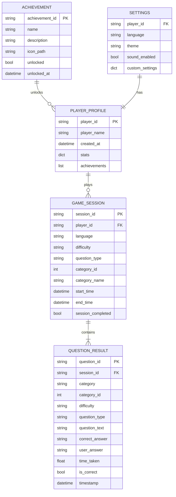

# Entities ER Diagram

This ER diagram shows the relationships between the main entities in the Traity quiz system:

- Player profiles track overall game statistics
- Game sessions record individual quiz attempts
- Question results store detailed performance data
- Achievements track player milestones
- Settings manage user preferences
