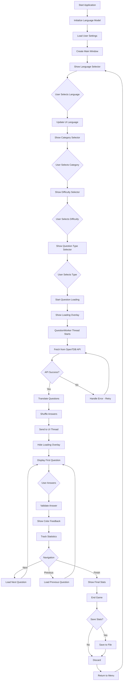

# Game Flowchart

```mermaid
flowchart TD
    A[Start Application] --> B[Initialize Language Model]
    B --> C[Load User Settings]
    C --> D[Create Main Window]
    D --> E[Show Language Selector]
    
    E --> F{User Selects Language}
    F --> G[Update UI Language]
    G --> H[Show Category Selector]
    
    H --> I{User Selects Category}
    I --> J[Show Difficulty Selector]
    
    J --> K{User Selects Difficulty}
    K --> L[Show Question Type Selector]
    
    L --> M{User Selects Type}
    M --> N[Start Question Loading]
    
    N --> O[Show Loading Overlay]
    O --> P[QuestionWorker Thread Starts]
    P --> Q[Fetch from OpenTDB API]
    
    Q --> R{API Success?}
    R -->|Yes| S[Translate Questions]
    R -->|No| T[Handle Error - Retry]
    T --> Q
    
    S --> U[Shuffle Answers]
    U --> V[Send to UI Thread]
    
    V --> W[Hide Loading Overlay]
    W --> X[Display First Question]
    
    X --> Y{User Answers}
    Y --> Z[Validate Answer]
    Z --> AA[Show Color Feedback]
    AA --> BB[Track Statistics]
    
    BB --> CC{Navigation}
    CC -->|Next| DD[Load Next Question]
    CC -->|Previous| EE[Load Previous Question]
    CC -->|Finish| FF[Show Final Stats]
    
    DD --> X
    EE --> X
    FF --> GG[End Game]
    
    GG --> HH{Save Stats?}
    HH -->|Yes| II[Save to File]
    HH -->|No| JJ[Discard]
    II --> JJ
    JJ --> KK[Return to Menu]
    KK --> E
```

This flowchart shows the complete game flow from application start to game completion, including error handling and navigation.
