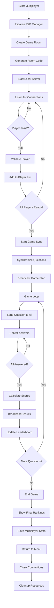

# P2P Multiplayer Flowchart

```mermaid
flowchart TD
    A[Start Multiplayer] --> B[Initialize P2P Manager]
    B --> C[Create Game Room]
    
    C --> D[Generate Room Code]
    D --> E[Start Local Server]
    
    E --> F[Listen for Connections]
    F --> G{Player Joins?}
    
    G -->|Yes| H[Validate Player]
    G -->|No| F
    
    H --> I[Add to Player List]
    I --> J{All Players Ready?}
    
    J -->|No| F
    J -->|Yes| K[Start Game Sync]
    
    K --> L[Synchronize Questions]
    L --> M[Broadcast Game Start]
    
    M --> N[Game Loop]
    N --> O[Send Question to All]
    O --> P[Collect Answers]
    
    P --> Q{All Answered?}
    Q -->|No| P
    Q -->|Yes| R[Calculate Scores]
    
    R --> S[Broadcast Results]
    S --> T[Update Leaderboard]
    
    T --> U{More Questions?}
    U -->|Yes| N
    U -->|No| V[End Game]
    
    V --> W[Show Final Rankings]
    W --> X[Save Multiplayer Stats]
    X --> Y[Return to Menu]
    
    Y --> Z[Close Connections]
    Z --> AA[Cleanup Resources]
```

This flowchart shows the peer-to-peer multiplayer game flow, including room creation, player synchronization, and game management.
