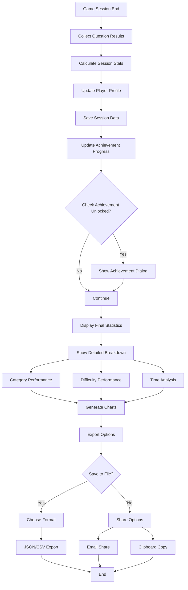

# Statistics Flowchart

```mermaid
flowchart TD
    A[Game Session End] --> B[Collect Question Results]
    B --> C[Calculate Session Stats]
    C --> D[Update Player Profile]
    
    D --> E[Save Session Data]
    E --> F[Update Achievement Progress]
    
    F --> G{Check Achievement Unlocked?}
    G -->|Yes| H[Show Achievement Dialog]
    G -->|No| I[Continue]
    
    H --> I
    I --> J[Display Final Statistics]
    
    J --> K[Show Detailed Breakdown]
    K --> L[Category Performance]
    K --> M[Difficulty Performance]
    K --> N[Time Analysis]
    
    L --> O[Generate Charts]
    M --> O
    N --> O
    
    O --> P[Export Options]
    P --> Q{Save to File?}
    Q -->|Yes| R[Choose Format]
    Q -->|No| S[Share Options]
    
    R --> T[JSON/CSV Export]
    S --> U[Email Share]
    S --> V[Clipboard Copy]
    
    T --> W[End]
    U --> W
    V --> W
```

This flowchart illustrates the statistics tracking and display system, including achievement checking and data export features.
